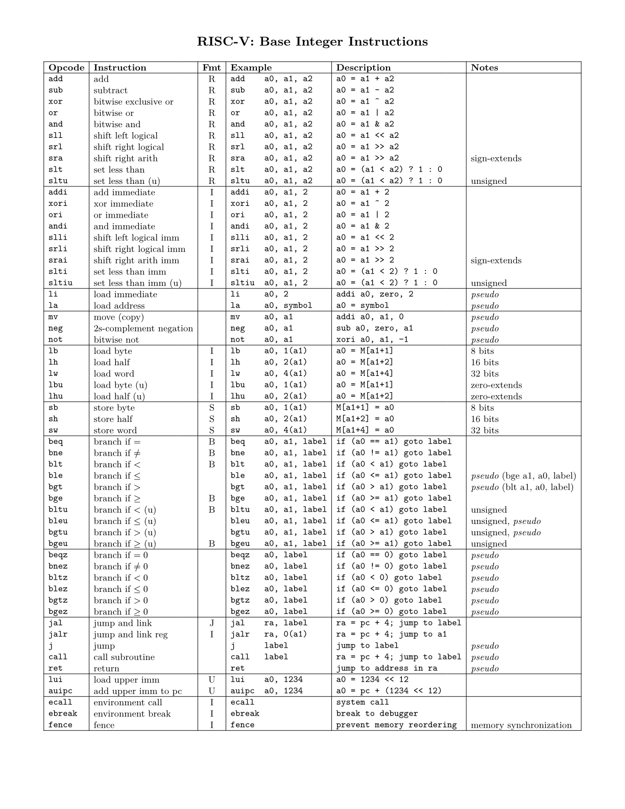
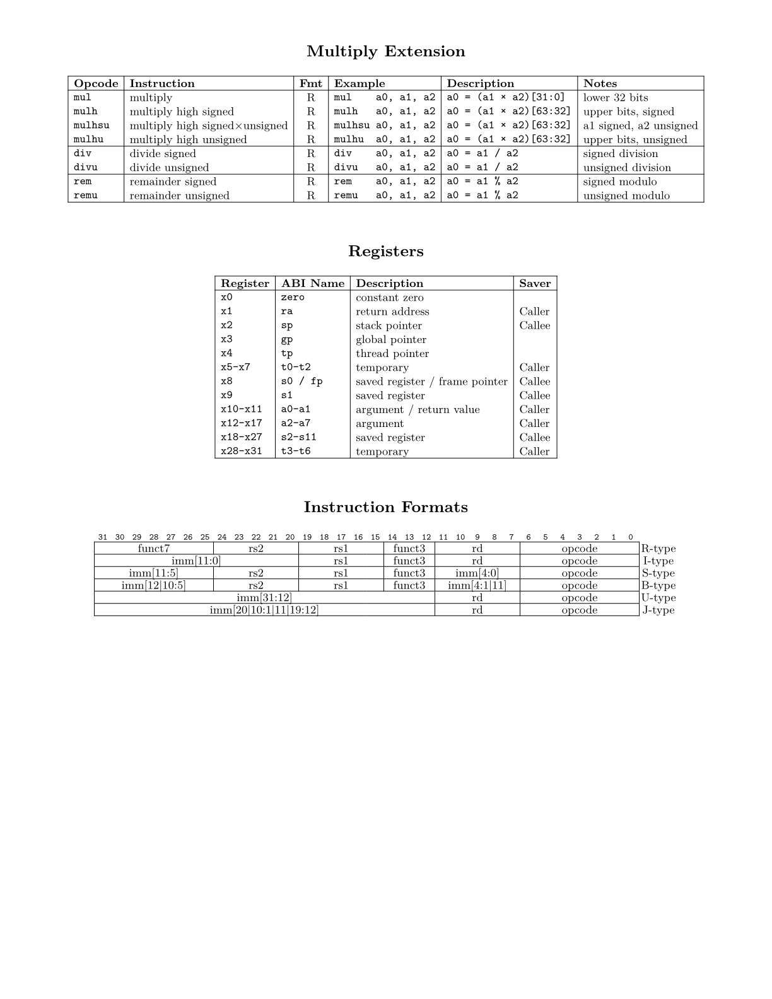

# RISC-V Quick Reference Card

A compact quick reference card (single sheet of paper, double sided) for the RV32I base integer instruction set, the M extension, registers, and instruction formats.

<p>
  
  
</p>

This copies liberally from [jameslzhu/riscv-card](https://github.com/jameslzhu/riscv-card) and is licensed under [CC-BY-4.0](LICENSE).


## Build

```sh
typst compile riscv-card.typ
```


## Install Typst

Linux (Debian/Ubuntu flavors):

```sh
curl -fsSL https://install.typst.community/install.sh | sh
```

macOS:

```sh
brew install typst
```

## Install Latin Modern Fonts

Linux (Debian/Ubuntu flavors):

```sh
sudo apt install fonts-lmodern
```

macOS:

```sh
brew install --cask font-latin-modern
```
